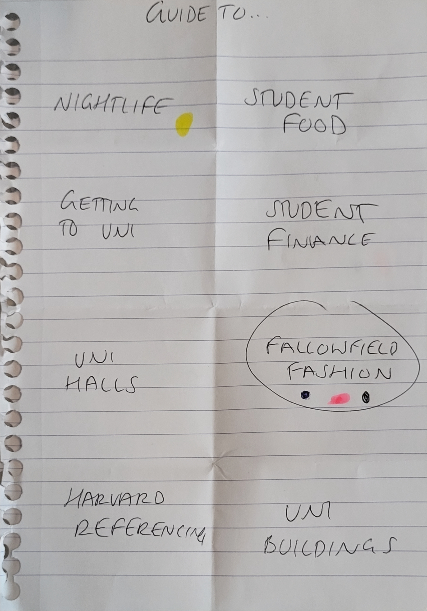
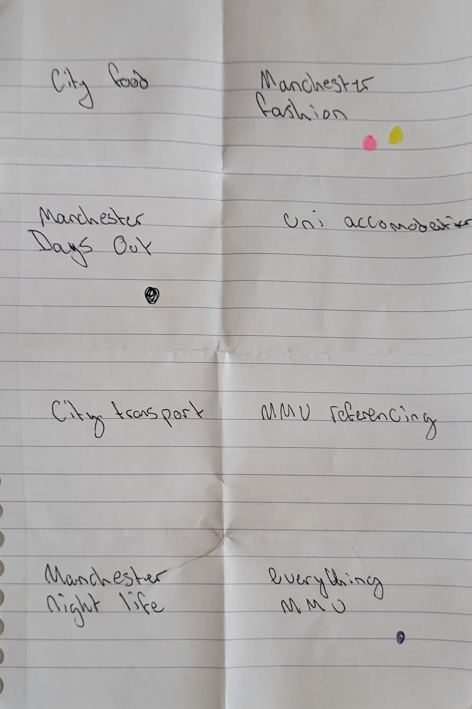
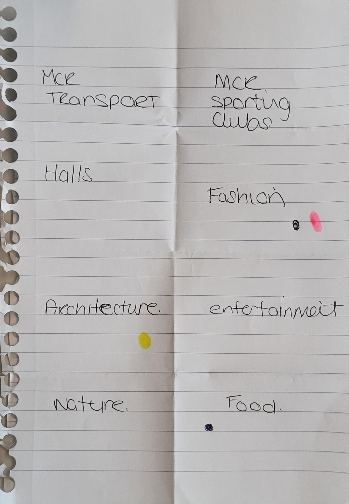
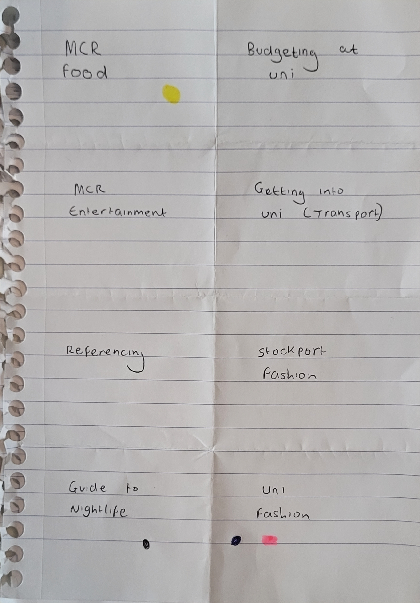

# Ideation Report
**Word count** 300 words maximum

Describe and illustrate your ideation process. Describe the techniques use and report on the output/results.

Has it helped you define you project? Explore a variety of ideas in a short time? Get ann agreement on the topic of your guide? Investigate possibilities?

Put your media in the `sp1-media` folder.

We began by partaking in a self-hosted crazy 8s session to find a number of ideas for the 'Guide to' concept. 
In 8 minutes, we wrote 8 ideas on a sheet of paper, then swapped between us, each giving a vote in the form of a coloured dot on the idea we liked the most from each sheet.

| Leon   | Jack         | Sam H | Sam S |
| :-------------: |:-------------:| :-----:|:-------:|
|||||

Upon synthesising the votes, we discovered that the highest number of votes went to the broad idea of 'fashion'. Each team member suggested fashion in varying degrees, which led to discussion on how broad the idea of 'fashion' could be. We decided to reduce the scope to cater to a more specific target audience to ensure that we provided a stronger user experience for the demographic we aimed to reach. As the client wants a 'student guide to', and Fallowfield is a student-dense area of Manchester, we agreed on the colloquial topic of 'Fallowfield fashion'.

