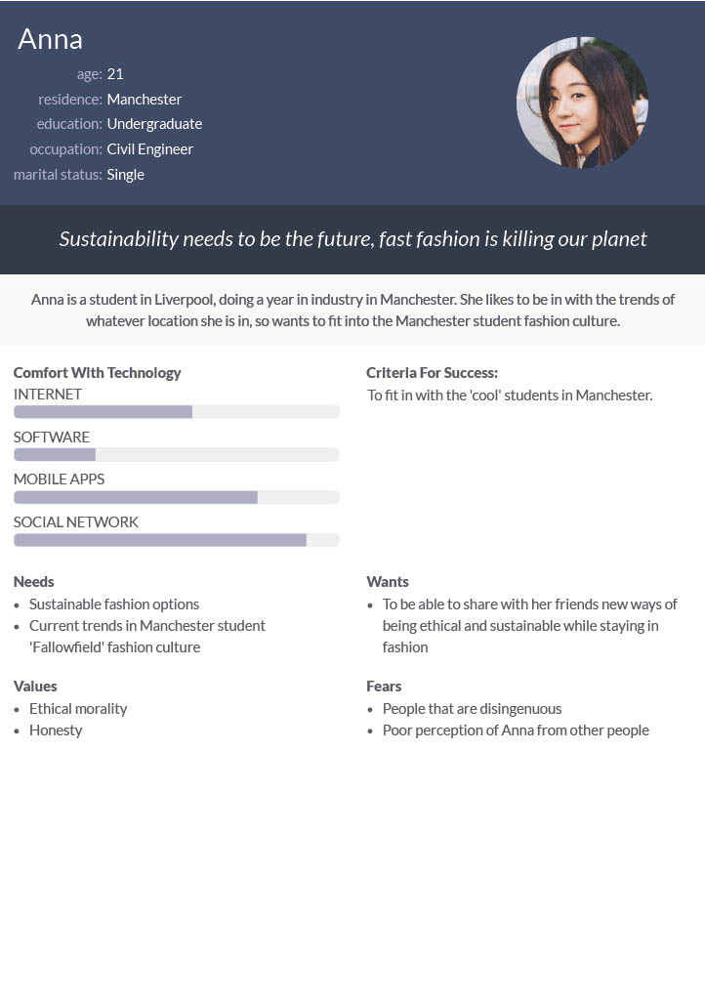

# Personas

Add your three personas.

*Tutors will download the image to view the full size persona*.

<!-- edit as required -->

## Matthew's persona
We interviewed Matthew to get his views on fashion and and of things he would expect a website like ours to offer. Because he is a student, we expect our target audience to have similar views as him.

### Caitlin's persona
We interviewed Caitlin because she has an interest in fashion and wants to find out about the current trends in Fallowfield. She also fits our target audience as she is a student and lives in Fallowfield.

---

### Anna's persona
We interviewed Anna to get her opinions of fashion and topics related to the project, along with her ability with technology and the way that she utilises it.

---

