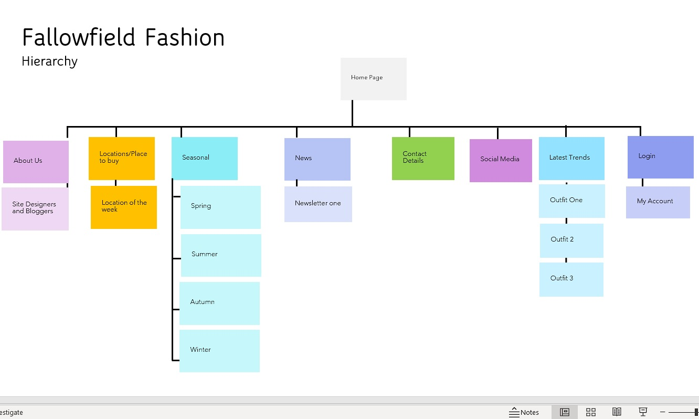

# Site Plan

Add your initial site plan for SP2, and any further revisions for SP5. Include commentary.

*Tutors will download the image to view the full size persona*.

## Original Site Plan

### Commentary
This is the first site plan following round one of tree testing however it was found to be sometimes to narrow to find some of the categories hence a second site plan and second dite plan. 

## Site Plan v2

### Commentary
Here we have revised post tree testing round 2 where the categories were broader and 75% of respondents found all the catergories. We have moved the locations block to include bars/clubs and have the catergory of locatiosn instead of the narrow place to buy. Furthermore, Social media now has seperate pages for each social media item and a send us a style page which details this. There is a new category of clothing which features men, womens and unisex much easier to decifer than last time. for now we have settled on this but as we test further throughout site design this may be refined.

---

## Site Plan v3

### Commentary
Detail your revisions. If it helps, highlight the changes on the site plan itself.

