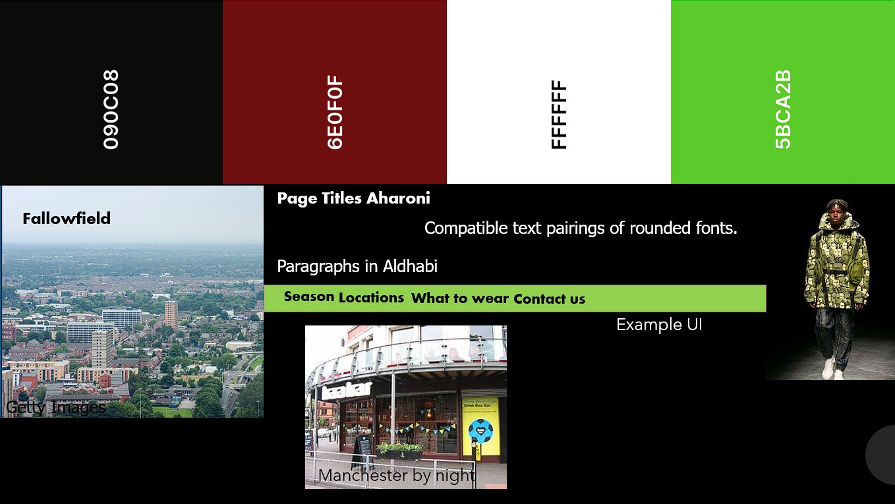
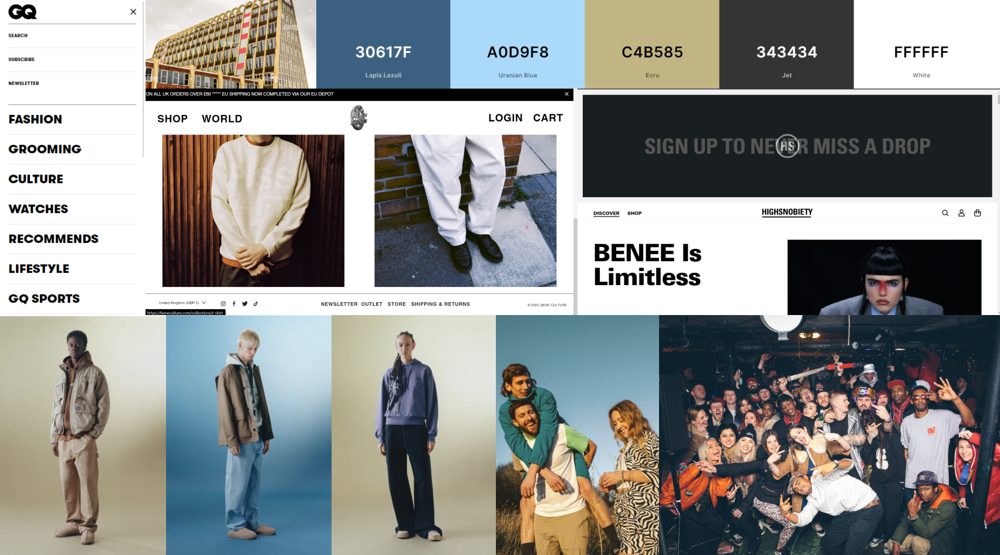
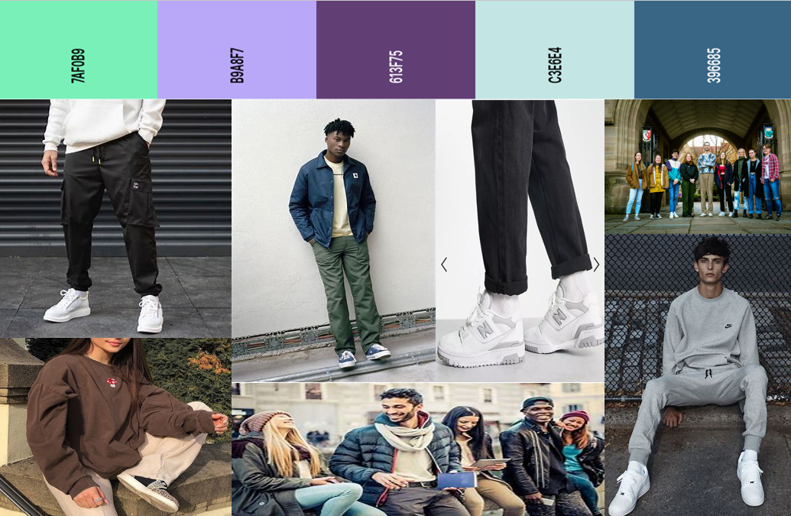

# Moodboards

Add a moodboard for each team member plus a final team moodboard.

*Tutors will download the image to view the full size persona*.

<!-- edit as required -->

## Moodboard One

### Name of team member
Jack Forster 
I liked the colours fitting together the black and white for a sleek monochrome look and then red to represent the red brick of manchester and green as I liked the shade and felt it was a good contrast on the black background. 
The images represent our brand and fallowfield itself. 
The rounded fonts were light and supposed to represent the fun brand we aim to be.

---

## Moodboard Two

### Sam Snape
I took inspiration from other famous related fashion websites, such as Vogue, Asos…etc. I also like the the Simplistic look, using black, white and neutral colours. It allows the the content of the website to stand out, and focuses the attention of the user on the featured content.

---

## Moodboard Three

### Leon Haffie-Hobday
Most student fashion takes inspiration from brands such as Carhartt, Dickies, alongside music, specifically rave culture. It features lots of earthy tones, and I have captured the contrast between the sleek, colourless web structures and the images that they use. The images in these sites are where the colour comes from, to draw attention to the colours and the fashion design of the artists involved.

---

## Moodboard Four

### Sam Harding
I took inspiration from well known student fashion brands such as Carhartt, Nike etc. I've opted for a variety of colours however they are all fairly light to enable the outfits to take the centre of attention. 

---

## Team Moodboard

### Group 1

As a group we each made an individual moodboard, When then came together to agree on the colour scheme for our website. We agreed on simplistic style, allowing the focus to be on content of the site. We then consolidated our inspirations for the site, and agreed on a set of images which best encapulated our ideas for future content.

---
