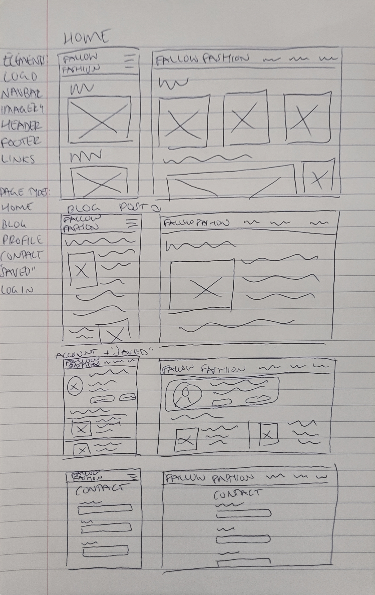
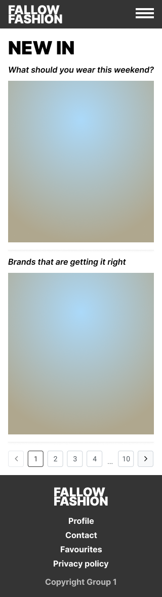

# Design process and high fidelity page mock up

You should add evidence of your group’s design process here. Begin with artefacts created by the whole team, then the high fidelity mockup.

## Group Artefacts

Please add at least one artefact per group member related to the exploration of designs for your website.

Leon's Low-Fidelity Wireframe ideas

Sam's Low-Fidelity Wireframe ideas

## High Fidelity mock-up

Add a screenshot of a single high fidelity mock up of one important page of your site, including all global elements (e.g. navigation and page footer).

Leon's High-Fidelity Wireframe idea for mobile home view with hamburger navigation and footer

