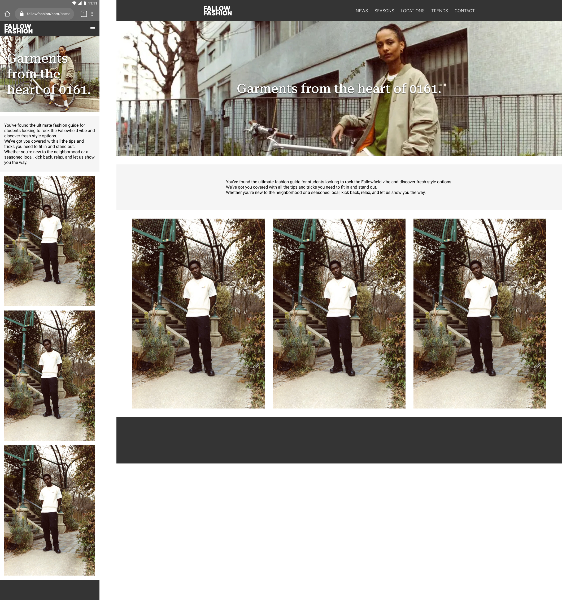

# Page mock up update

Use this area to show the updated version, incorporating changes made after user testing, of the page you originally created for SP3.
# Changes made after user testing
- Locations icon has been turned into a dropdown icon. On the mobile view, the user taps the hamburger item on the nav menu to open these options.
- Social media icons have been removed.
- The footer will contain the ability to subscribe to the site's newsletter. This is out of scope to show on the mock up due to the complexity of the form.

# New mock up

# Changes to be made following further testing
- New imagery to be added to columns, to incorporate more colour to the site.
