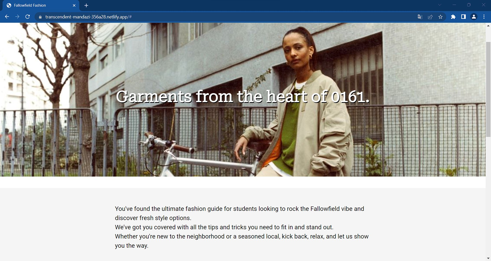

# Internationalisation

Have chosen four main languages worldwide as this allows for the students of Manchester to either understand in a native language or one they speak comfortably. 

## Language One

### Notes
No issues present 

---

## Language Two

### Notes
No issues present 

---

## Language Three

No issues present 

## Language Four

No issues present 

---
