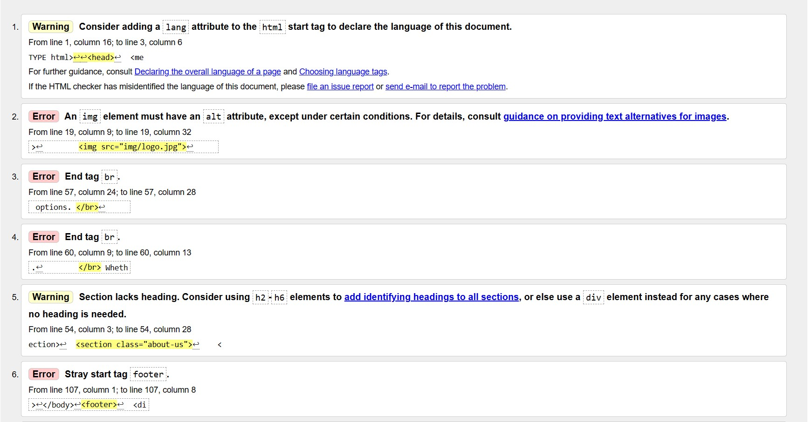
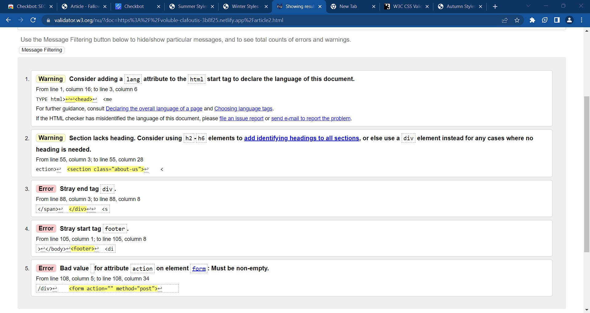

# Quality Audit

The quality audit performed went well there was some remidiation along the way and a few issues we couldnt resolve but mostly this returned that we had optomised code that performed well. 

## HTML Validation

Report pre validation

This first screenshot shows the index.html pre fix with numerous issues, these were resolved and now there are two warnings and two errors. The warnings are one for a language tag as which we ignore as this allows us to reach consumers who only want results from their native languages that would be excluded if we used english here and another warning in the contact form which we will look to resolve but didnt have time in this sprint over a duplication of an email tag. Furthermore the error has one point for a stray footer tag which we couldnt identify and seemed to be fine when reading through the code so ignored this and secondly, there was an div closing tag which was reported however, if removed this left the class open to not format correctly so was ignored again as the page then condensed. Outside the initial validation we used checkbot to validate the code again which detected some broken URLs which are now resolved and can be seen in the screenshots below.

Fixed

The report post validation fix.

The comments were identical across the site and the report above reflects this. 

## CSS Validation

The CSS validates perfectly on all sites can be seen from screenshot below for index.html. 

## Speed test (inc. optimisation of code and media)

The speed on the site was rated at 86% by checkbot on chrome this is due to compressed images and optimised code. We lost speed due to long caching times which can cause data to become stale but at this point in our knowledge and with tools available there wasnt much we could do about this however if allowed we could have harnessed tools on the cloud such as elasticache or lambda to host code. Overall we had a good result and fixed or remidiated many of the issue slowing our site down such as numerous redirects to keep a responsive and quick loading site keeping in with our user research for users that want information now. 

## Readability testing
Our text is puposely written in slang and short this is to suit our readers who would use these terms reguarly and want to read information quickly in this format. We believed from our user research this could build credibility between us and our users as this is how they would speak to friends therfore to some users outside of our targetted base may feel this format is wrong but its an aim to put this information across like this as it fits our brand. 

## SEO

Checkbot scored at 70% which is a good score however I think this would have been higher if not for our news article pages these seem to drag us down as they were named article 1,2,3 and 4 however,  it is difficult to give these unique names as the article will be changing reguarly. Although we may miss out on unique titles and URLS on these pages alone the other pages of the website should draw the user in. Additionally if we reguarly upgrade page description will optomise these further for SEO should as including the news title in the description.
